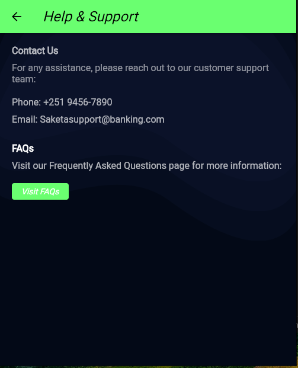

# Flutter Banking Mobile App (UI Demo)

## Table of Contents

- [Flutter Banking Mobile App (UI Demo)](#flutter-banking-mobile-app-ui-demo)
  - [Table of Contents](#table-of-contents)
  - [Overview](#overview)
  - [Features](#features)
  - [Screenshots](#screenshots)
  - [Technologies Used](#technologies-used)
  - [Setup \& Installation](#setup--installation)
  - [Folder Structure](#folder-structure)
  - [Contributing](#contributing)
  - [Contact](#contact)

## Overview

This is a **UI-only demo** of a banking mobile application developed during my internship project. The app is designed to simulate real-world banking functionalities, providing users with an intuitive and engaging interface for key banking operations. Even though the app doesn't integrate with an actual backend or database, it emulates a realistic user experience by utilizing mock data and map collections to handle actions such as login, transactions, fund transfers, and logout.

**Note:** All interactions, such as user registration, login, account details, and transactions, are simulated using static data stored in map collections. These allow the app to function seamlessly for demonstration purposes without needing a backend.

## Features

- **Welcome Page:** The entry point of the app that introduces users with a smooth transition, leading them to registration or login.
- **Registration & Login:** Users can register and log in using a simulated authentication system where their credentials (username and password) are stored in a map collection. Login functionality is implemented to resemble real-world scenarios.
- **Home Page:** Displays the user’s account summary, including balance and recent transactions, all populated using static data for demonstration.
- **Account Detail:** Provides detailed information about the user’s account, including available balance and recent transaction history, fetched from mock data.
- **Bill Payment:** Simulates paying bills by selecting predefined options. This feature mimics real bill payment processes.
- **Transfer Fund:** Users can simulate transferring funds between accounts. The transactions are reflected within the app using static map collections to emulate real-time fund transfers.
- **Transaction History:** Displays a list of the user’s past transactions. The data is pulled from a mock dataset, providing users with a realistic view of their transaction history.
- **Settings:** Allows users to adjust app preferences and settings. Although preferences are not persisted, the interface mirrors how settings would work in a production app.
- **Support:** Simulates a customer support page where users can access help or assistance, showcasing how a support feature would integrate into a banking app.
- **Drawer Navigation:** Contains buttons that allow users to easily navigate between different sections of the app, including a logout option for secure exit.
- **Logout:** Simulates a real logout process where the user is securely logged out and redirected to the **Welcome Page**. After logging out, there is no option to return to the previous session unless the user logs in again, ensuring a realistic and secure user experience similar to real banking applications.

## Screenshots

Here are sample screenshots of the app, showcasing its features and simulating real banking functionalities despite not having a database:

| Screen                                                      | Description                                                                                                                                                                                 |
| ----------------------------------------------------------- | ------------------------------------------------------------------------------------------------------------------------------------------------------------------------------------------- |
|                          | **Welcome Page:** The first screen users see when launching the app. It introduces the app and leads users to the login or registration pages.                                              |
|                              | **Login Screen:** Users can log in using their registered username and password stored in the app’s map dictionary collection. Authentication is simulated for a realistic experience.      |
|                                | **Home Page:** Displays the user’s account balance, recent transactions, and navigation options to other features. Data is populated using mock values for a smooth banking experience.     |
|            | **Account Detail:** Shows detailed information about the user’s account, such as available balance and recent transactions. All data is fetched from the simulated map collection.          |
|                | **Bill Payment:** Users can simulate paying bills by selecting from predefined options. This process mimics a real banking app’s bill payment functionality.                                |
|  | **Transaction History:** Shows a list of the user’s past transactions, pulled from mock data. It provides a realistic view of how transactions would appear in a live banking app.          |
|              | **Transfer Fund:** Users can simulate transferring funds between accounts or to another user. The transfer process updates the map collection, giving the illusion of a live fund transfer. |
|                        | **Settings:** Allows users to update their preferences within the app. Although changes are not persisted, this screen mirrors how a settings page in a live app would function.            |
|                          | **Support:** Provides users with a static support page to simulate contacting customer service for assistance with their banking needs.                                                     |
|                            | **Drawer Navigation:** Contains a list of navigation buttons for users to easily switch between different app screens, including a logout button for secure exit.                           |

## Technologies Used

- **Flutter**: Cross-platform framework for developing high-quality apps for iOS and Android from a single codebase.
- **Dart**: The primary programming language used for developing the app.
- **Map Collection:** Used in place of backend database systems for handling user data, transactions, and other functionalities within this demo.

## Setup & Installation

1. **Clone the repository:**

   ```bash
   git clone https://github.com/samkiyya/banking-mobile-app.git
   cd banking-mobile-app
   ```

2. **Install dependencies:**

   ```bash
   flutter pub get
   ```

3. **Run the app:**

   - For Android:

   ```bash
   flutter run
   ```

   - For iOS:

     ```bash
     flutter run --release
     ```

**Note:** All functionalities, including registration, login, account management, transactions, and logout, are simulated using hardcoded values and mock data stored in map collections. There are no real backend services or databases connected in this demo, but the app is designed to mimic the behavior of a real banking application.

## Folder Structure

Here is the folder structure of the project:

```bash
lib/
├── animations/                      # Contains animations for screen transitions
│   └── fade_animation.dart          # Animation for login and welcome screen transitions
├── controllers/                     # Controller files handling logic for each screen
│   ├── account_details_controller.dart
│   ├── bill_payment_controller.dart
│   ├── controller_data_layer.dart
│   ├── home_controller.dart
│   ├── login_controller.dart
│   ├── settings_controller.dart
│   ├── support_controller.dart
│   ├── trans_history_controller.dart
│   ├── transfer_funds_controller.dart
│   └── welcome_controller.dart
├── models/                          # Data models for each feature
│   ├── account_details_model.dart
│   ├── bill_payment_model.dart
│   ├── home_model.dart
│   ├── login_model.dart
│   ├── models_data_layer.dart
│   ├── settings_model.dart
│   ├── support_model.dart
│   ├── trans_history_model.dart
│   ├── transfer_funds_model.dart
│   └── welcome_model.dart
├── utilities/                       # Contains utility widgets
│   └── background_widget.dart       # Consistent background widget used across screens
├── view/                            # All UI screens
│   ├── account_details_screen.dart
│   ├── bill_payment_screen.dart
│   ├── home_screen.dart
│   ├── login_screen.dart
│   ├── screen_package.dart
│   ├── settings_screen.dart
│   ├── support_screen.dart
│   ├── transaction_history_screen.dart
│   ├── transfer_funds_screen.dart
│   └── welcome_splash_screen.dart
├── main.dart                        # Entry point of the app
assets/
├── images/                          # Assets folder for images
│   └── logo.png                     # App logo
screenshots/                         # Screenshots of the app UI for the README
```

## Contributing

If you'd like to contribute to the project, feel free to submit a pull request or raise an issue to suggest improvements or additional features to enhance the UI demonstration.

## Contact

If you have any questions or feedback, feel free to reach out!

- **LinkedIn**: [Samuel Aberra](https://linkedin.com/in/samkiyya)
- **GitHub**: [Samkiyya](https://github.com/samkiyya)
